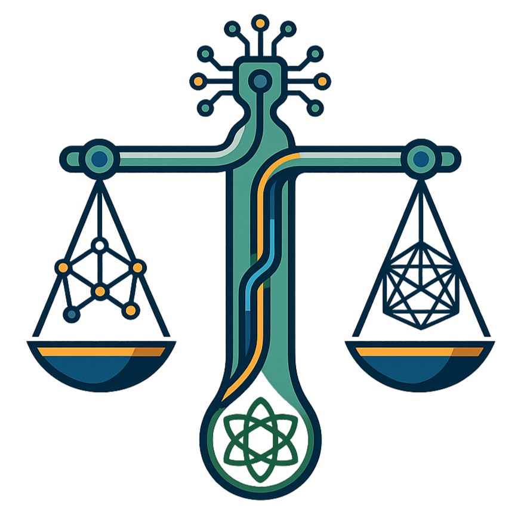

<div align="center">
  
  <h1>Ethos AI</h1>
  <p><strong>Audit AI systems for demographic bias. Built for India.</strong></p>

  <p>
    <a href="https://ethos-ca278.web.app"></a>
    
    
    
  </p>
</div>

---

> **Hiring, lending, and admissions AI in India is trained on decades of historical data that encoded caste, gender, and religious inequalities. Most organisations deploying these systems have no way to measure this. Ethos AI gives them one.**

---

## The Problem

Every major AI fairness tool -- IBM AIF360, Microsoft Fairlearn, Google What-If Tool -- was designed for EEOC-regulated employment in the United States. They test for race and gender in the US legal context.

India's bias landscape is different:

- **Caste** is the dominant axis of structural inequality. No existing tool has India-specific caste name databases for counterfactual testing.
- **Regional bias** (North Urban vs. Northeast India) is documented in research but unmeasurable with existing tooling.
- **LLM probing** -- testing the AI system itself for bias before deployment -- is not implemented by any of these tools. They audit datasets, not live models.
- **Indian law** (DPDP Act 2023, Articles 15/16, RBI Fair Practices Code) creates a distinct compliance landscape that no existing tool maps to.

---

## How It Works

### 1. LLM Counterfactual Probe

Based directly on the Bertrand and Mullainathan (2004) resume audit methodology: send identical prompts to an AI, change only the applicant's name, measure whether decision rates differ between demographic groups.

```
Same prompt sent twice — only the name changes:

  "Applicant: Anand Sharma, 4 yrs exp, B.Tech CS, Python/SQL/AWS ..."
  "Applicant: Dilip Kamble, 4 yrs exp, B.Tech CS, Python/SQL/AWS ..."

Measured outputs:
  Acceptance rate per group
  Acceptance rate differential (percentage points)
  Disparate Impact Ratio          (EEOC threshold: 0.80)
  Fisher's exact test p-value     (statistical significance)
  Sentiment differential          (tone analysis across group responses)
  Risk level: LOW / MEDIUM / HIGH / CRITICAL
```

If the AI gives materially different decisions to identical candidates whose only difference is a name carrying a demographic signal, that is measurable bias. The tool quantifies it, explains it, and maps it to Indian compliance law.

**Bias dimensions:** Caste (upper caste vs SC/ST surnames) · Religion (Hindu vs Muslim) · Gender (male vs female) · Region (North Urban vs Northeast India)

**Domains:** HR/Hiring · Bank Lending · University Admissions · Healthcare Triage

**Targets:** Gemini 2.0 · Any HTTP API endpoint · Controlled simulator (shows what detected bias looks like)

### 2. ML Model Fairness Audit

Upload any CSV with a binary outcome column and a sensitive attribute column. Get six fairness metrics computed against published thresholds:

| Metric | Threshold | Source |
|--------|-----------|--------|
| Demographic Parity Difference | < 0.10 | NIST AI RMF |
| Disparate Impact Ratio | > 0.80 | EEOC 4/5 Rule |
| False Positive Rate Difference | < 0.10 | Chouldechova (2017) |
| Equal Opportunity Difference | < 0.10 | Hardt et al. (2016) |
| Average Odds Difference | < 0.10 | Hardt et al. (2016) |
| Theil Index | < 0.10 | Kamiran & Calders (2012) |

Download a reweighed dataset with Kamiran-Calders sample weights applied -- ready for model retraining.

### 3. India AI Bias Map

Crowdsourced, anonymised reports of algorithmic discrimination across Indian states. Only state, domain, and bias type are stored -- no names, no contact info. Aggregated data creates evidence that individual complaints cannot.

---

## India Compliance Framework

Every probe report maps findings to the Indian legal instruments that apply:

| Law | Relevance |
|-----|-----------|
| **DPDP Act 2023** | Bias in automated decisions is a data rights violation; subjects can contest AI decisions |
| **Art. 15, Constitution** | Prohibits discrimination by religion, race, caste, sex, place of birth |
| **Art. 16, Constitution** | Equality of opportunity in employment; applies to AI-mediated hiring |
| **RBI Fair Practices Code** | Non-discriminatory lending algorithms mandated for regulated entities |
| **EEOC 4/5 Rule** | Selection rate below 80% of the highest group triggers disparate impact scrutiny |

---

## Architecture

```
Browser
   |
   | HTTPS
   v
React + Vite  ──  Firebase Hosting (GCP, global CDN)
   |
   | REST
   v
FastAPI  ──  GCP Cloud Run (containerised, auto-scaling)
   |
   |-- /probe/*     Persona Library  →  Gemini 2.0 Flash
   |                (India-specific name sets, 4 bias dimensions)
   |
   |-- /analyze     pandas + scipy (6 fairness metrics)
   |-- /mitigate    Kamiran-Calders reweighing
   |-- /explain     Gemini 2.0 Flash (plain-language explanations)
   |
   +-- /citizen/*   Firestore, asia-south1 (citizen reports)
```

The persona library contains curated Indian name sets for each bias dimension: upper-caste and SC/ST surnames, Hindu and Muslim names, gendered first names, and region-coded naming patterns. This is what makes the probing India-specific rather than generic.

---

## Stack

| Layer | Technology |
|-------|-----------|
| Frontend | React 18, Vite, Recharts, Lucide |
| Hosting | Firebase Hosting (GCP) |
| Backend | FastAPI, Python 3.11 |
| AI | Gemini 2.0 Flash via google-genai SDK |
| Fairness metrics | pandas, scipy, numpy |
| Database | Firestore (GCP, asia-south1) |
| Infra | GCP Cloud Run |

---

## Local Setup

```bash
git clone https://github.com/aadi-joshi/ethos.git
cd ethos

# Backend
cd backend
pip install -r requirements.txt
GEMINI_API_KEY=your_key uvicorn app.main:app --reload --port 8000

# Frontend
cd frontend
npm install
VITE_API_URL=http://localhost:8000 npm run dev
```

The app runs without credentials: in-memory Firestore fallback, and the sample simulator works with no API key.

| Variable | Notes |
|----------|-------|
| `GEMINI_API_KEY` | Free tier works; probe is rate-limited to stay within 15 RPM |
| `GOOGLE_APPLICATION_CREDENTIALS` | Firebase service account JSON path |
| `GCP_PROJECT_ID` | Firebase project ID |

---

## Sample Dataset

`frontend/public/sample_hiring_dataset.csv` -- synthetic hiring data with a `shortlisted` outcome and a `caste_group` sensitive attribute, constructed with a Disparate Impact Ratio below 0.80 so the audit immediately shows a flagged finding.

---

## Live

| | |
|--|--|
| **App** | [ethos-ca278.web.app](https://ethos-ca278.web.app) |
| **API docs** | [`/docs`](https://ccrnsaub9w.us-east-1.awsapprunner.com/docs) (FastAPI Swagger) |

---

## Research Foundation

**Bertrand, M. and Mullainathan, S. (2004).** "Are Emily and Greg More Employable than Lakisha and Jamal? A Field Experiment on Labor Market Discrimination." *American Economic Review*, 94(4), 991-1013.

The resume audit methodology is the direct basis for LLM counterfactual probing. The original experiment mailed 5,000 identical resumes to job listings, varying only the name. Ethos AI applies the same logic to AI prompts.

**Kamiran, F. and Calders, T. (2012).** "Data Preprocessing Techniques for Classification Without Discrimination." *Knowledge and Information Systems*, 33(1), 1-33.

The reweighing algorithm in the ML audit is from this paper. Sample weights equalise selection rates across sensitive groups as a preprocessing step before retraining.

---

<div align="center">

**Built by Team Maxout**

The tools to audit AI bias for India's unique social context didn't exist. We built them.

</div>
